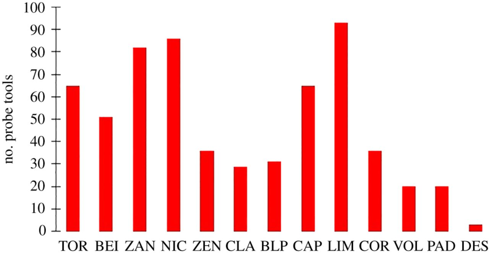
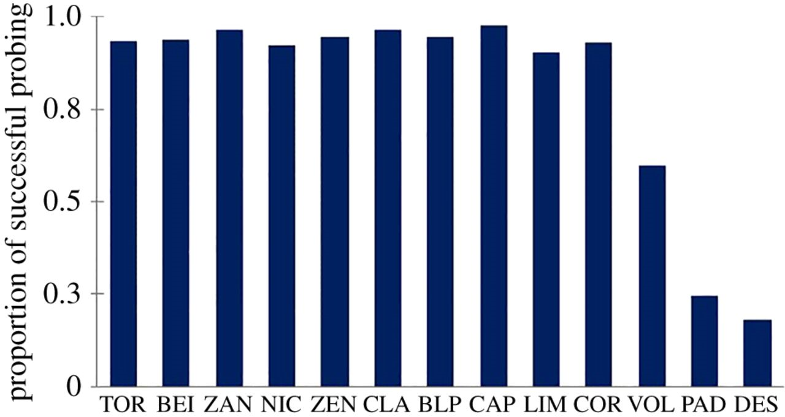

```{r setup, include=FALSE}
knitr::opts_chunk$set(echo = TRUE)
```


# Introduction

## Background
Cultural knowledge and traditions may affect individual cognition in wild populations of primates. In this study, the authors compare the performance of two wild populations of bearded capuchin monkeys (*Sapajus libidinosus*) with two distinct tool use repertoires in a novel probing task. Only the population that already exhibited the use of probing tools was able to solve the foraging problem, suggesting that group cultural traditions significantly affect individual problem-solving in these populations.

## Methodology & Analyses
The researchers studied two populations of bearded capuchin monkeys living in northeastern Brazil:

  1. The Fazenda Boa Vista (FBV) group, which customarily uses stone tools to crack nuts, but not probe tools. (n = 16)
  
  2. The Serra da Capivara National Park (SCNP) group, which customarily uses a very broad toolkit, *including* stick probing tools. (n = 23)
  
The researchers set up a novel probing task using a transparent box and sugarcane molasses that was only obtainable by inserting a probe through a slit in the top of the box. For this replication, the relevant data they recorded is the following:

  * number of times visited
  * total length of time visited
  * average time spent per visit
  * number of probe events
  * number of successes
  * number of probe tools used

## My replication

loading in the data:
```{r}
library(curl)
f <- curl("https://raw.githubusercontent.com/clairezng/clairezh-AN588-Replication/main/DATASET_CARDOSO&OTTONI.csv")
d <- read.csv(f, header = TRUE, stringsAsFactors = FALSE)
head(d) # looks fine
```

## descriptive statistics:
authors stated that the SCNP capuchins visited the boxes at a mean = 213 visits/day; SD = 55; total individual visits = 1067. the FBV capuchins visited the boxes at a mean = 29 visits/day; SD = 12; total individual visits = 376

partitioning the two populations into separate datasets
```{r}
SCNP <- subset(d, POPULATION == "SCNP")
FBV <- subset(d, POPULATION == "FBV")
SCNP
FBV # looks okay!
```

calculating mean and SD number of visits for the SCNP population:
```{r}
SCNPtotal <- sum(SCNP$NUMVISIT)
SCNPtotal
SCNPmean <- SCNPtotal/5 # exposed to the boxes for 5 days
SCNPmean
```

everything looks fine! the mean denotes the total number of visits from all individuals divided by the number of days they were exposed to the box.

looking at the FBV population:
```{r}
FBVtotal <- sum(FBV$NUMVISIT)
FBVtotal
FBVmean <- FBVtotal/13
FBVmean
```

the total doesn't add up correctly. if it did, their mean and standard deviation would be right (i.e., 376/13)

trying the "Mann-Whitney test" they do. They say the Z = -4541, p < 0.0001. I'm honestly not even sure what they're calculating the statistics *of*, but my best guess is that it's comparing the frequency of probe use in the SCNP group vs. the FBV population. also, I'm assuming that the Mann-Whitney test is an unpaired two-sample Wilcoxon test

```{r}
mw.probes <- wilcox.test(SCNP$PROBE.EVENT, FBV$PROBE.EVENT, paired = FALSE)
mw.probes
```

this doesn't give me enough information, except that the p-value isn't correct, so maybe they ran the Mann-Whitney test on something else?

in the table, they list values for length of the direct engagement with the task and the mean time of visits, so I'll try it for that too:
```{r}
mw.time <- wilcox.test(SCNP$TIME.VISIT, FBV$TIME.VISIT, paired = FALSE)
mw.time # p-value = 2.987e-07, which could definitely be the p < 0.0001 value they're talking about
mw.meantime <- wilcox.test(SCNP$Mean_TIMEVISIT, FBV$Mean_TIMEVISIT, paired = FALSE)
mw.meantime # okay, this spits out a p-value = 5.623e-06, which could also be the p < 0.0001 value they list
```

these definitely seem more promising. now I need to figure out the Z-score of -4541, which seems absurd. In order to assume a normal distribution, both $n_{1}$ (the SCNP group) and $n_{2}$ (the FBV group) would have to be more than 20, which they aren't. 

Nevertheless, we have to convert the W values the Wilcoxon Rank Sum test spits out into Mann-Whitney U values.


R tells me that R's value can also be computed as the number of all pairs (x[i], y[j]) for which y[j] is not greater than x[i], the most common definition of the Mann-Whitney test. To ME, this seems like the W value is also the value of U.

Running into another problem here: 306 and 294 seem like the *larger* of the two U values, so I'll reorder my variables
```{r}
mw.time2 <- wilcox.test(FBV$TIME.VISIT, SCNP$TIME.VISIT, paired = FALSE)
mw.time2
mw.meantime2 <- wilcox.test(FBV$Mean_TIMEVISIT, SCNP$Mean_TIMEVISIT, paired = FALSE)
mw.meantime2
```

there we go! U = 16 when comparing total direct interaction time, and U = 28 when comparing mean time per visit. 

in order to get a Z-value, we *must* assume U is approximately normally distributed. so let's just say it is, even though the sample sizes fall a little bit short.

$$z = \frac{U - \mu_{U}}{\sigma_{U}}$$

where the mean of U, $\mu_{U} = \frac{n_{1}n_{2}}{2}$,
and the standard deviation of U, $\sigma_{U} = \sqrt{\frac{n_{1}n_{2}(n_{1}+n_{2}+1)}{12}}$


I'm going to write a function to calculate the Z-score at least, because I need to run two different values (and may have to deal with more later:

  * note that I tried to use the qnorm() function to find the Z-score. just trust me that it did not work.
  
  * i'm also going to use a continuity correction of 0.5, because the Mann-Whitney U value hypothetically exists in a discrete distribution, we are approximating it to a normal distribution, and my sample size is small.
```{r}
mw.z <- function(U, n1, n2, correction = TRUE) {
  mean_U <- (n1*n2) / 2
  sd_U <- sqrt((n1*n2*(n1+n2+1))/12)
  correction <- if (correction) 0.5 else 0
  z <- (U - mean_U - correction) / sd_U
  print(z)
}
mw.z(16, length(FBV$TIME.VISIT), length(SCNP$TIME.VISIT))
mw.z(28, length(FBV$Mean_TIMEVISIT), length(SCNP$Mean_TIMEVISIT))
```

these are terribly close (minus the decimal point). maybe i'll take out the continuity correction:
```{r}
mw.z(16, length(FBV$TIME.VISIT), length(SCNP$TIME.VISIT), correction = FALSE)
mw.z(28, length(FBV$Mean_TIMEVISIT), length(SCNP$Mean_TIMEVISIT), correction = FALSE)
```

OH MY GOD the Z = -4.540868 is what we're looking for because if you round it to the thousandth it's -4.541 which is the number they state. except (obviously) their value is missing a decimal point but maybe that's just a typo. THANK GOD. okay so they're looking at the difference between the length of direct interaction(s) between the two groups.

moving on to recreating figure one and figure two. they are pretty simple bar graphs.

  * as a note, they are only looking males in the SCNP group, so I'll be pruning the data accordingly.
  * they also removed CIN, presumably because he had 0 probe events despite being in the SCNP group
```{r}
library(ggplot2)
names(SCNP)
SCNP_males <- subset(SCNP, SEX == "MALE")
SCNP_males <- SCNP_males[SCNP_males$ID !="CIN", ]
SCNP_males # checking this
```

I'm also going to reorder individuals because I want to match the order they're listed in within the paper.
```{r}
SCNP_males$ID <- factor(SCNP_males$ID, levels = c("TOR", "BEI", "ZAN", "NIC", "ZEN", "CLA", "BLP", "CAP", "LIM", "COR", "VOL", "PAD", "DES"))
# plotting!
ggplot(data=SCNP_males, aes(x=ID, y=NUMBER.OF.PROBE.TOOLS)) +
  geom_bar(stat="identity", fill="red", width = 0.5) + 
  labs(x = element_blank(), y = "no. probe tools", caption = "Figure 1. Number of sticks used by each monkey of the SCNP group.") +
  theme(plot.caption = element_text(hjust = 0)) +
  scale_y_continuous(breaks = seq(0, 100, by = 10), expand=expansion(mult=c(0,0.01))) 
```

and here is the original Figure 1 from the paper:

{width=70%}


this makes the fact that the figures are inaccurate MUCH more noticeable - the researchers' graphs definitely aren't to scale, and it seems to outright plot some values incorrectly?

Figure 2 replication:
```{r}
# first, calculating proportions of successful probing:
SCNP_males$PROBE.SUCCESS <- SCNP_males$SUCCESSFUL/SCNP_males$PROBE.EVENT
SCNP_males$PROBE.SUCCESS # looks fine

# plotting:
ggplot(data=SCNP_males, aes(x=ID, y=PROBE.SUCCESS)) +
  geom_bar(stat="identity", fill="navy", width = 0.5) + 
  labs(x = element_blank(), y = "proportion of successful probing", caption = "Figure 2. Proportions of successful probing by each monkey of the SCNP group.") + 
  theme(plot.caption = element_text(hjust = 0)) +
  scale_y_continuous(breaks = seq(0, 1.0, by = 0.2), expand = expansion(mult = c(0,0.05))) 
```

and here is the original Figure 2:

{width=70%}


My y-axis intervals aren't entirely accurate, but I can't comprehend why the original figure lists 0, 0.3, 0.5, 0.8, and 1.