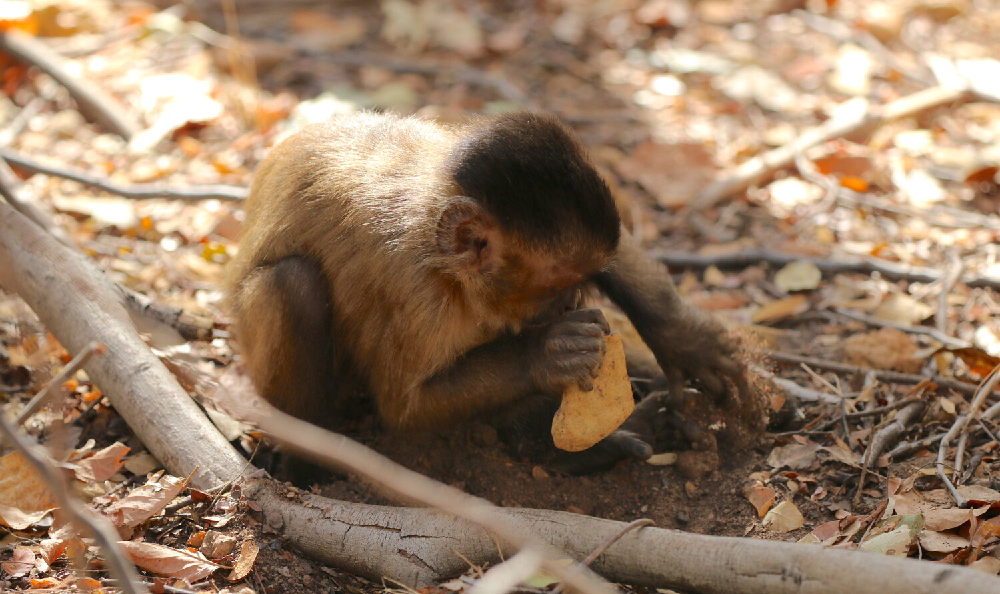

```{r setup, include=FALSE}
knitr::opts_chunk$set(echo = TRUE, warning = FALSE, comment = "##", prompt = TRUE, tidy = TRUE, tidy.opts = list(width.cutoff = 75), fig.path = "img/")
```




# Introduction

## Background
Cultural knowledge and traditions may affect individual cognition in wild populations of primates. In this study, the authors compare the performance of two wild populations of bearded capuchin monkeys (*Sapajus libidinosus*) with two distinct tool use repertoires in a novel probing task. Only the population that already exhibited the use of probing tools was able to solve the foraging problem, suggesting that group cultural traditions significantly affect individual problem-solving in these populations.

## Methodology
The researchers studied two populations of bearded capuchin monkeys living in northeastern Brazil:

  1. The Fazenda Boa Vista (FBV) group, which customarily uses stone tools to crack nuts, but not probe tools. (n = 16)
  
  2. The Serra da Capivara National Park (SCNP) group, which customarily uses a very broad toolkit, *including* stick probing tools. (n = 23)
  
The researchers set up a novel probing task using a transparent box and sugarcane molasses that was only obtainable by inserting a probe through a slit in the top of the box. For this replication, the relevant data they recorded is the following:

  * number of times visited
  * total length of time visited
  * average time spent per visit
  * number of probe events
  * number of successes
  * number of probe tools used
  
## My replication
I will be replicating all the statistical analyses ran in this paper. Most of them are descriptive:

  * **mean** and **standard deviation** of the total number of visits for both groups
  * **mean, standard deviation, median, and range** for the length of direct interaction(s) for both groups
  
There is one inferential statistic: 

  * A mystery **Mann-Whitney U test**, otherwise known as a two-sample Wilcoxon rank sum test. More on this later.
  
I will also replicate both figures from this paper:

  * a bar graph depicting the number of sticks used per individual
  * a bar graph depicting proportion of successful probing by each individual

## Preparation
### Load packages:
```{r}
library(curl)
library(ggplot2)
```

### Loading in the data:
```{r}
f <- curl("https://raw.githubusercontent.com/clairezng/clairezh-AN588-Replication/main/DATASET_CARDOSO&OTTONI.csv")
d <- read.csv(f, header = TRUE, stringsAsFactors = FALSE)
# checking whether the data loaded correctly
head(d) # looks fine!
```

### Dividing populations
Before we start, it'll also be helpful to partition the two populations (SCNP & FBV) into separate datasets in r, for ease of calculation later on.
```{r}
SCNP <- subset(d, POPULATION == "SCNP")
FBV <- subset(d, POPULATION == "FBV")
SCNP
FBV # looks okay!
```


# Descriptive statistics
The researchers stated:
  
  * SCNP capuchins visited the boxes at a mean = 213 visits/day; SD = 55; total individual visits = 1067. 
  * FBV capuchins visited the boxes at a mean = 29 visits/day; SD = 12; total individual visits = 376

Calculating mean for SCNP visits:
```{r}
SCNPtotal <- sum(SCNP$NUMVISIT)
SCNPtotal
SCNPmean <- SCNPtotal/5 # exposed to the boxes for 5 days
SCNPmean
```

Everything looks fine! The mean denotes the total number of visits from all individuals divided by the number of days they were exposed to the box.

  * do note that I was not able to use the mean() function: the researchers are calculating average *total* visits per day, not average visits per individual. I was puzzled over this for a good amount of time.

Standard deviation is a bit more tricky - because we're calculating average total visits per day, and not average number of visits per individual, the sd() function will not work here.
  
  *I'm going to write a sample standard deviation function, but to be quite honest, I'm not sure what to use to calculate the difference from the mean
```{r}
sample_sd <- function(x, mean) {
  n <- length(x)
  mean_x <- mean
  sqdiff <- (x - mean_x)^2
  variance <- sum(sqdiff) / (n-1)
  sd <- sqrt(variance)
  return(sd)
}
sample_sd(SCNP$NUMVISIT, SCNPmean)
```

this is definitely not right. **deal with it later**

looking at the FBV population:
```{r}
FBVtotal <- sum(FBV$NUMVISIT)
FBVtotal
```

immediately, we can see the total number of visits for the FBV group (368) does not match what the researchers say it is (376). I'm choosing to chalk it up to a reduced dataset, but will be calculating the mean and standard deviation with the dataset I have access to.

calculating mean:
```{r}
FBVmean <- FBVtotal/13
FBVmean 
```

If the total visits added up correctly, their mean would be correct (i.e., 376/13 = 28.92)

Running into the same problem with standard deviation: I don't know what values they're pulling from in calculating squared differences, but my method can't be right.
```{r}
sample_sd(FBV$NUMVISIT, FBVmean)
```

Not quite right either. Trying it with the mean they provide:
```{r}
sample_sd(FBV$NUMVISIT, 376/13)
```


I struggle to comprehend the purpose of calculating the mean number of visits per day for the entire population, not by individual. I understand that there is a very large difference between the means, but without some kind of statistical comparison between the two, the researchers don't get their intentions across completely.

For time data, the researchers stated the following: "FBV: mean time = 75 s, s.d. = 75 s, median = 48 s, range = 648 s; SCNP: mean time = 156 s, s.d. = 176 s, median = 92 s, range = 1398 s"

Here is what I think that means:

  1. mean time = the average of each individual's *mean time per visit*
    a. both standard deviation and median will be calculated from individual *mean time per visit* values
  2. range = the longest *total time visiting* - the shortest *total time visiting* among all individuals in each population

starting with the FBV population:
```{r}
mean(FBV$Mean_TIMEVISIT)
# immediately we have a problem. trying a different method of calculating mean:
FBVtotal.length <- sum(FBV$TIME.VISIT)
FBVtotal.visits <- sum(FBV$NUMVISIT)
FBVmean.visit <- (FBVtotal.length/FBVtotal.visits)
FBVmean.visit
```

it seems that instead of pulling from the "mean time per visits" data column, the researchers have instead summed up the total time visiting for every individual and divided it by the total number of visits to find the average length of time per visit.

I suppose standard deviation could potentially be calculated using the mean time per visit of individuals and the mean value we derived earlier?
```{r}
sample_sd(FBV$Mean_TIMEVISIT, FBVmean.visit)
```

this isn't working, so I'm going to re-calculate the "Mean_TIMEVISIT" value by hand, and use that instead:
```{r}
FBV$average.visit <- FBV$TIME.VISIT/FBV$NUMVISIT
# trying again
sample_sd(FBV$average.visit, FBVmean.visit)
```

unfortunately, nowhere close to the 75 we're looking for. it's close to the value we already have, so I don't think miscalculation of the mean time value is the issue.

trying median now:
```{r}
median(FBV$Mean_TIMEVISIT)
```

unfortunately, 67 =/ 48. 

range?
```{r}
max(FBV$TIME.VISIT)-min(FBV$TIME.VISIT)
```

that also can't be right. Genuinely, I'm so tired of troubleshooting at this point, I'm tempted to cut out this entire section.

With our experience from the FBV population, hopefully calculating values for the SCNP population will be easier:

mean
```{r}
SCNPtotal.length <- sum(SCNP$TIME.VISIT)
SCNPtotal.visits <- sum(SCNP$NUMVISIT)
SCNPmean.visit <- (SCNPtotal.length/SCNPtotal.visits)
SCNPmean.visit
```

the mean looks right. I'll run through the rest of the statistics, but they will likely continue to be incorrect!

standard deviation, median, range:
```{r}
sample_sd(SCNP$Mean_TIMEVISIT, SCNPmean.visit)
median(SCNP$Mean_TIMEVISIT)
max(SCNP$TIME.VISIT)-min(SCNP$TIME.VISIT)
```

all terribly off, as expected. I definitely need to re-examine my methods, I might be messing something up in my code or my data.


# Inferential Statistics
The only reference to the **Mann-Whitney U test** (or Wilcoxon rank-sum test) the researchers conduct is a section of text in Table 1 that states:
"Mann-Whitney test: *Z* = -4541, *p* < 0.0001, two-tailed."

Because of the lack of description, and the fact that the objective of this paper is to demonstrate different tool use repertoires, my immediate inclination is that the test is being used to evaluate the frequency of probe use, denoted by the "PROBE.EVENT" variable.

```{r}
mw.probes <- wilcox.test(SCNP$PROBE.EVENT, FBV$PROBE.EVENT, paired = FALSE)
mw.probes
```

the p-value here (0.0008902) does not match up with the *p* < 0.0001 they provide, so I need to look at other variables.

In the table, they list values for length of the direct engagement with the task and the mean time of visits, so I'll try it for that too:
```{r}
mw.time <- wilcox.test(SCNP$TIME.VISIT, FBV$TIME.VISIT, paired = FALSE)
mw.time # p-value = 2.987e-07, which could definitely be the p < 0.0001 value they're talking about
mw.meantime <- wilcox.test(SCNP$Mean_TIMEVISIT, FBV$Mean_TIMEVISIT, paired = FALSE)
mw.meantime # okay, this spits out a p-value = 5.623e-06, which could also be the p < 0.0001 value they list
```

These definitely seem more promising; both p-values are less than 0.0001. 

Next, I need to figure out this Z-score of -4541, which seems impossible to obtain. There are a couple steps to this:

  * Find the Mann-Whitney U values for both tests
  * From the U values, approximate a Z-score using a normal distribution

Luckily, the W values R spits out from the wilcox.test() function are equivalent to the U values. Unluckily, for a reason unknown to me, R has given me the **larger** of the two W (or U) values obtained from the Wilcoxon-Mann-Whitney test.

After some finagling, I realized I just need to swap the order of my variables:
```{r}
mw.time2 <- wilcox.test(FBV$TIME.VISIT, SCNP$TIME.VISIT, paired = FALSE)
mw.time2
mw.meantime2 <- wilcox.test(FBV$Mean_TIMEVISIT, SCNP$Mean_TIMEVISIT, paired = FALSE)
mw.meantime2
```

That looks a lot more reasonable! U = 16 when comparing total interaction time, and U = 28 when comparing mean time per visit.


In order to assume a normal distribution, both $n_{1}$ (the SCNP group) and $n_{2}$ (the FBV group) would have to be more than 20, which they aren't. 

in order to get a Z-value, we *must* assume U is approximately normally distributed. so let's just say it is, even though the sample sizes fall a little bit short.

$$z = \frac{U - \mu_{U}}{\sigma_{U}}$$

where the mean of U, $\mu_{U} = \frac{n_{1}n_{2}}{2}$,
and the standard deviation of U, $\sigma_{U} = \sqrt{\frac{n_{1}n_{2}(n_{1}+n_{2}+1)}{12}}$


I'm going to write a function to calculate the Z-score at least, because I need to run two different values (and may have to deal with more later:

  * note that I tried to use the qnorm() function to find the Z-score. just trust me that it did not work.
  
  * i'm also going to use a continuity correction of 0.5, because the Mann-Whitney U value hypothetically exists in a discrete distribution, we are approximating it to a normal distribution, and my sample size is small.
```{r}
mw.z <- function(U, n1, n2, correction = TRUE) {
  mean_U <- (n1*n2) / 2
  sd_U <- sqrt((n1*n2*(n1+n2+1))/12)
  correction <- if (correction) 0.5 else 0
  z <- (U - mean_U - correction) / sd_U
  print(z)
}
mw.z(16, length(FBV$TIME.VISIT), length(SCNP$TIME.VISIT))
mw.z(28, length(FBV$Mean_TIMEVISIT), length(SCNP$Mean_TIMEVISIT))
```

these are terribly close (minus the decimal point). maybe i'll take out the continuity correction:
```{r}
mw.z(16, length(FBV$TIME.VISIT), length(SCNP$TIME.VISIT), correction = FALSE)
mw.z(28, length(FBV$Mean_TIMEVISIT), length(SCNP$Mean_TIMEVISIT), correction = FALSE)
```

OH MY GOD the Z = -4.540868 is what we're looking for because if you round it to the thousandth it's -4.541 which is the number they state. except (obviously) their value is missing a decimal point but maybe that's just a typo. THANK GOD. okay so they're looking at the difference between the length of direct interaction(s) between the two groups.

moving on to recreating figure one and figure two. they are pretty simple bar graphs.

  * as a note, they are only looking males in the SCNP group, so I'll be pruning the data accordingly.
  * they also removed CIN, presumably because he had 0 probe events despite being in the SCNP group
```{r}
library(ggplot2)
names(SCNP)
SCNP_males <- subset(SCNP, SEX == "MALE")
SCNP_males <- SCNP_males[SCNP_males$ID !="CIN", ]
SCNP_males # checking this
```

I'm also going to reorder individuals because I want to match the order they're listed in within the paper.
```{r}
SCNP_males$ID <- factor(SCNP_males$ID, levels = c("TOR", "BEI", "ZAN", "NIC", "ZEN", "CLA", "BLP", "CAP", "LIM", "COR", "VOL", "PAD", "DES"))
# plotting!
ggplot(data=SCNP_males, aes(x=ID, y=NUMBER.OF.PROBE.TOOLS)) +
  geom_bar(stat="identity", fill="red", width = 0.5) + 
  labs(x = element_blank(), y = "no. probe tools", caption = "Figure 1. Number of sticks used by each monkey of the SCNP group.") +
  theme(plot.caption = element_text(hjust = 0)) +
  scale_y_continuous(breaks = seq(0, 100, by = 10), expand=expansion(mult=c(0,0.01))) 
```

and here is the original Figure 1 from the paper:

{width=70%}


this makes the fact that the figures are inaccurate MUCH more noticeable - the researchers' graphs definitely aren't to scale, and it seems to outright plot some values incorrectly?

Figure 2 replication:
```{r}
# first, calculating proportions of successful probing:
SCNP_males$PROBE.SUCCESS <- SCNP_males$SUCCESSFUL/SCNP_males$PROBE.EVENT
SCNP_males$PROBE.SUCCESS # looks fine

# plotting:
ggplot(data=SCNP_males, aes(x=ID, y=PROBE.SUCCESS)) +
  geom_bar(stat="identity", fill="navy", width = 0.5) + 
  labs(x = element_blank(), y = "proportion of successful probing", caption = "Figure 2. Proportions of successful probing by each monkey of the SCNP group.") + 
  theme(plot.caption = element_text(hjust = 0)) +
  scale_y_continuous(breaks = seq(0, 1.0, by = 0.2), expand = expansion(mult = c(0,0.05))) 
```

and here is the original Figure 2:

{width=70%}


My y-axis intervals aren't entirely accurate, but I can't comprehend why the original figure lists 0, 0.3, 0.5, 0.8, and 1.